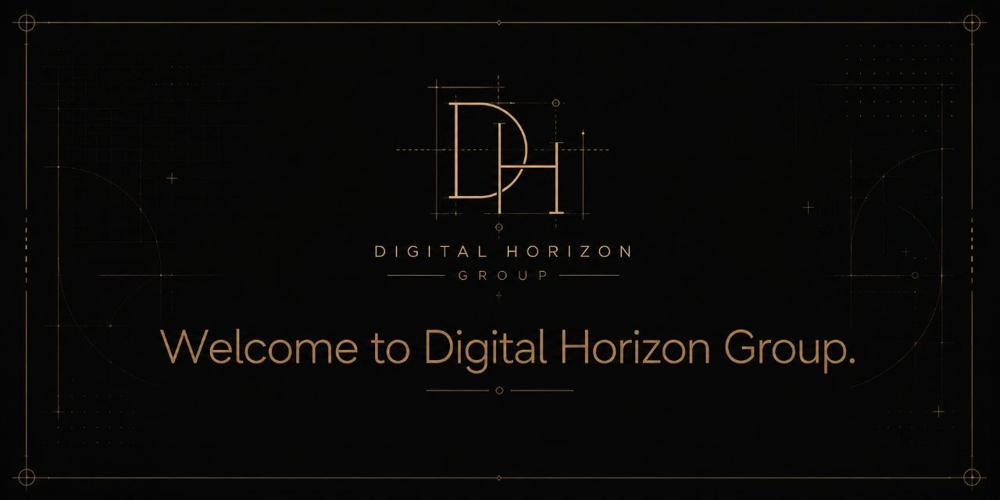

# Digital Horizon Group

We build open-source tools for Telegram analytics, automation, and data reporting.

## Featured project

### [Telegram Chat & Channel Parser](https://github.com/digitalhorizongroup/Parser_telegram_chat)

A Python and Telethon parser that searches public Telegram chats and channels, analyzes audience activity, and exports structured statistics to Excel.

Key capabilities:

- Search Telegram chats and channels by keywords
- Collect participant and online-user statistics
- Analyze messages from the last 24 hours
- Detect voice chats and live streams
- Export formatted Excel reports

**Tech stack:** Python, Telethon, openpyxl, asyncio

[View the project](https://github.com/digitalhorizongroup/Parser_telegram_chat) · [Report an issue](https://github.com/digitalhorizongroup/Parser_telegram_chat/issues)

## Community

Have a question, an idea, or want to collaborate?

- [Telegram](https://t.me/digitalhorizongroup)
- [Discord](https://discord.com/invite/fjqzSYCETC)
- [Email](mailto:info@digitalhorizon.group)
